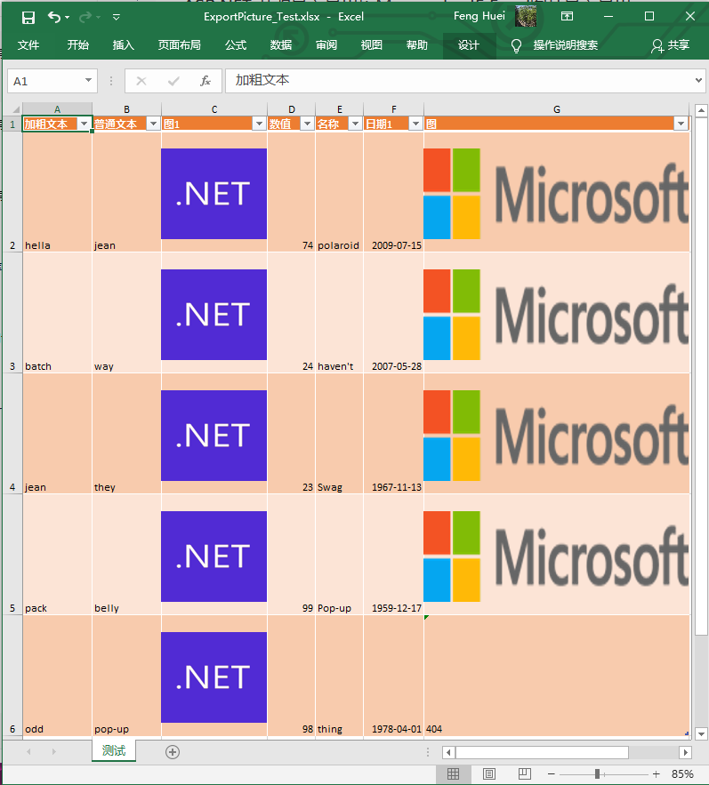

# Magicodes.IE Excel图片导入导出

## 说明

本章主要说明使用 Magicodes.IE Excel图片导入导出的使用

## 要点

- 配置DTO进行Excel图片导出
- 配置DTO进行Excel图片导入

## 导入导出特性

### ExportImageFieldAttribute

+ **Height**： 高度(默认15)
+ **Width**：宽度(默认50)
+ **Alt**：图片不存在时替换文本

### ImportImageFieldAttribute

+ **ImageDirectory**：  图片存储路径（默认存储到临时目录） 
+ **ImportImageTo**：图片导出方式（默认Base64）


## 主要步骤


### 1.安装包Magicodes.IE.Excel

```powershell
Install-Package Magicodes.IE.Excel
```

### 2.导出Excel

Excel导出,图片导出需求时我们需要在属性中添加**ExportImageFieldAttribute**

```csharp
   [ExcelExporter(Name = "测试")]
    public class ExportTestDataWithPicture
    {
        [ExporterHeader(DisplayName = "加粗文本", IsBold = true)]
        public string Text { get; set; }

        [ExporterHeader(DisplayName = "普通文本")] public string Text2 { get; set; }
        [ExporterHeader(DisplayName = "忽略", IsIgnore = true)]
        public string Text3 { get; set; }

        [ExportImageField(Width = 20, Height = 120)]
        [ExporterHeader(DisplayName = "图1")]
        public string Img1 { get; set; }
        [ExporterHeader(DisplayName = "数值", Format = "#,##0")]
        public decimal Number { get; set; }
        [ExporterHeader(DisplayName = "名称", IsAutoFit = true)]
        public string Name { get; set; }
        /// <summary>
        /// 时间测试
        /// </summary>
        [ExporterHeader(DisplayName = "日期1", Format = "yyyy-MM-dd")]
        public DateTime Time1 { get; set; }

        [ExportImageField(Width = 50, Height = 120, Alt = "404")]
        [ExporterHeader(DisplayName = "图", IsAutoFit = false)]
        public string Img { get; set; }
    }
```

目前导出可以设置为远程图片，以及本地图片形式，并且也支持空导出

```csharp
        public async Task ExportPicture_Test()
        {
            IExporter exporter = new ExcelExporter();
            var url = Path.Combine("TestFiles", "ExporterTest.png");
            for (var i = 0; i < data.Count; i++)
            {
                var item = data[i];
                item.Img1 = url;
                if (i == 4)
                    item.Img = null;
                else
                    item.Img = "https://docs.microsoft.com/en-us/media/microsoft-logo-dark.png";
            }
            var result = await exporter.Export(filePath, data);
        }
```




### 3.导入Excel

#### 导入到临时目录

**ImportImageTo枚举**
- **Base64**  导入为base64格式

- **TempFolder** 导入到临时目录

```csharp

    public class ImportPictureDto
    {
        [ImporterHeader(Name = "加粗文本")]
        public string Text { get; set; }
        [ImporterHeader(Name = "普通文本")]
        public string Text2 { get; set; }

        /// <summary>
        /// 将图片写入到临时目录
        /// </summary>
        [ImportImageField(ImportImageTo = ImportImageTo.TempFolder)]
        [ImporterHeader(Name = "图1")]
        public string Img1 { get; set; }
        [ImporterHeader(Name = "数值")]
        public string Number { get; set; }
        [ImporterHeader(Name = "名称")]
        public string Name { get; set; }
        [ImporterHeader(Name = "日期")]
        public DateTime Time { get; set; }

        /// <summary>
        /// 将图片写入到临时目录
        /// </summary>
        [ImportImageField(ImportImageTo = ImportImageTo.TempFolder)]
        [ImporterHeader(Name = "图")]
        public string Img { get; set; }
    }

```

```csharp
        public async Task ImportPicture_Test()
        {
            var filePath = Path.Combine(Directory.GetCurrentDirectory(), "TestFiles", "Import", "图片导入模板.xlsx");
            var import = await Importer.Import<ImportPictureDto>(filePath);
            if (import.Exception != null) _testOutputHelper.WriteLine(import.Exception.ToString());

            if (import.RowErrors.Count > 0) _testOutputHelper.WriteLine(JsonConvert.SerializeObject(import.RowErrors));
        }

```


#### 将图片导入为base64

```csharp

    public class ImportPictureBase64Dto
    {
        [ImporterHeader(Name = "加粗文本")]
        public string Text { get; set; }
        [ImporterHeader(Name = "普通文本")]
        public string Text2 { get; set; }

        /// <summary>
        /// 将图片导入为base64（默认为base64）
        /// </summary>
        [ImportImageField(ImportImageTo = ImportImageTo.Base64)]
        [ImporterHeader(Name = "图1")]
        public string Img1 { get; set; }

        [ImporterHeader(Name = "数值")]
        public string Number { get; set; }
        [ImporterHeader(Name = "名称")]
        public string Name { get; set; }
        [ImporterHeader(Name = "日期")]
        public DateTime Time { get; set; }

        /// <summary>
        /// 将图片导入到临时目录
        /// </summary>
        [ImportImageField(ImportImageTo = ImportImageTo.TempFolder)]
        [ImporterHeader(Name = "图")]
        public string Img { get; set; }
    }

```

```csharp

public async Task ImportPictureBase64_Test()
        {
            var filePath = Path.Combine(Directory.GetCurrentDirectory(), "TestFiles", "Import", "图片导入模板.xlsx");
            var import = await Importer.Import<ImportPictureBase64Dto>(filePath);
        }

```


## Reference

https://github.com/dotnetcore/Magicodes.IE


